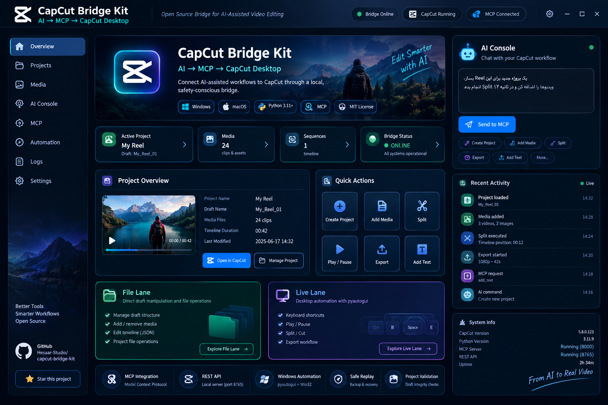

# 🎬 CapCut Bridge Kit

### AI → MCP → CapCut Desktop Bridge for Windows & macOS

<p align="center">
  <strong>
    A local-first, provider-neutral bridge connecting external AI systems
    to CapCut Desktop through structured inspection, analysis, validation,
    execution and verification.
  </strong>
</p>

<p align="center">
  
</p>

<p align="center">
  <a href="https://github.com/Hesaar-Studio/capcut-bridge-kit">
    
  </a>
  
  
  
  
  
</p>

<p align="center">
  🇬🇧 <a href="#-english">English</a>
  &nbsp;•&nbsp;
  🇮🇷 <a href="#-فارسی">فارسی</a>
  &nbsp;•&nbsp;
  🇨🇳 <a href="#-中文">中文</a>
</p>

---

# 🇬🇧 English

## 📖 Overview

**CapCut Bridge Kit** is an open-source, local-first bridge for connecting
external AI systems, MCP clients, developer tools and automation workflows
to **CapCut Desktop** on Windows and macOS.

The project is intentionally designed as a **bridge and execution layer**,
not as an autonomous AI video editor.

The core architecture is:

```text
┌─────────────────────────────────────────────────────────────┐
│                       EXTERNAL AI                            │
│                                                             │
│  ChatGPT • Claude • Gravity • Gemini • Other AI Systems    │
│                                                             │
│  Understands the user's request                             │
│  Reasons about the editing task                             │
│  Makes editing decisions                                    │
│  Creates structured editing plans                            │
└──────────────────────────────┬──────────────────────────────┘
                               │
                               │ MCP / API / Structured Contract
                               ▼
┌─────────────────────────────────────────────────────────────┐
│                    CAPCUT BRIDGE KIT                        │
│                                                             │
│  Capability Registry                                        │
│  Project Inspection                                         │
│  Timeline Inspection                                        │
│  Media Inspection                                           │
│  Subtitle Inspection                                        │
│  Smart Editing Analysis                                     │
│  Draft Engine                                               │
│  EditPlan Validation                                        │
│  Backup / Recovery                                          │
│  Dispatcher                                                 │
│  Execution                                                  │
│  Verification                                               │
│  Execution Receipts                                         │
└──────────────────────────────┬──────────────────────────────┘
                               │
                               ▼
┌─────────────────────────────────────────────────────────────┐
│                     CAPCUT DESKTOP                          │
│                                                             │
│  Timeline • Media • Text • Audio • Effects • Animation     │
│  Project Runtime • Export • Desktop Editing                 │
└─────────────────────────────────────────────────────────────┘
```

### The central rule

> **AI decides. Bridge executes. CapCut edits.**

The external AI is the decision maker.

The Bridge is the integration, validation and execution layer.

CapCut Desktop remains the actual editing runtime.

---

## 🎯 Project Goal

The goal of CapCut Bridge Kit is to make AI-assisted CapCut workflows:

- reproducible
- scriptable
- inspectable
- structured
- locally controlled
- safer to experiment with
- extensible through MCP
- extensible through REST/API adapters
- provider-neutral
- compatible with multiple AI clients

The intended workflow is:

```text
User
  ↓
External AI understands the request
  ↓
AI inspects the CapCut project
  ↓
Bridge returns structured facts
  ↓
AI reasons about the available information
  ↓
AI decides what should happen
  ↓
AI creates a structured EditPlan / operation
  ↓
Bridge validates the request
  ↓
Bridge checks capabilities and safety requirements
  ↓
Bridge executes supported operations
  ↓
CapCut Desktop performs the actual editing
  ↓
Bridge reads/verifies the result when possible
  ↓
ExecutionReceipt returned to the AI
  ↓
AI can continue the workflow
```

The Bridge should **not invent creative editing decisions** that belong to the external AI.

---

# 🧠 Architecture Principles

## AI = Director / Decision Maker

The external AI is responsible for:

- understanding natural-language requests
- interpreting user intent
- reasoning about project information
- choosing which Bridge capabilities to call
- deciding what should be edited
- creating editing plans
- deciding whether confirmation is required
- reviewing execution results
- continuing the workflow when appropriate

Examples of AI decisions:

```text
"Find the long pauses."

"These two takes appear to be duplicates."

"Keep the second take because it contains the better explanation."

"Prepare a plan to remove the identified pauses."

"Do not apply the plan until I confirm."
```

The Bridge should not independently make these creative decisions.

---

## Bridge = Execution + Integration Layer

The Bridge is responsible for:

- capability discovery
- project inspection
- timeline inspection
- media inspection
- subtitle inspection
- structured analysis
- validation
- safe routing
- backup/recovery
- execution
- verification
- execution receipts
- provider-neutral interfaces

The Bridge is not responsible for being an autonomous editor.

---

## CapCut = Editing Runtime

CapCut Desktop remains the actual editing environment.

The Bridge does not replace CapCut.

The Bridge connects external intelligence to CapCut.

---

# 🔌 Provider-Neutral Design

The internal contract is designed to remain independent of a specific AI provider.

The same Bridge architecture should be able to serve:

```text
ChatGPT
Claude
Gravity / Antigravity
Gemini
Other compatible AI systems
Developer tools
MCP clients
REST/API clients
```

The Bridge should not require a different internal editing contract for every provider.

The preferred model is:

```text
Provider
   ↓
Provider Adapter
   ↓
AI Editing Contract
   ↓
CapCut Bridge
```

This keeps the internal Bridge architecture stable.

---

# 🧩 Capability Registry

The Bridge should expose the capabilities it can **actually** perform.

Conceptual capability states include:

```text
available
unavailable
experimental
read_only
requires_confirmation
requires_live_capcut
```

A capability must never be advertised as available if the underlying implementation does not exist.

For example:

```json
{
  "name": "analyze_gaps",
  "state": "read_only"
}
```

does not mean that the Bridge is allowed to delete those gaps.

It means the Bridge can provide analysis.

The AI may then decide what should happen next.

---

# 🛠️ AI Editing Contract

The AI Editing Contract provides a stable language between external AI systems and the Bridge.

Conceptual operations include:

```text
get_capabilities
inspect_project
inspect_timeline
inspect_media
inspect_subtitles
analyze_gaps
analyze_duplicates
create_edit_plan
validate_edit_plan
preview_edit_plan
execute_edit_plan
verify_execution
get_execution_receipt
```

These identifiers are:

- machine-readable
- provider-neutral
- language-neutral
- stable

Human-facing text can be Persian, English, Chinese or another Unicode language.

---

# 🌍 First-Class Persian / Unicode Support

Persian/Farsi is a **first-class language requirement**.

The Bridge must support full UTF-8 / Unicode handling.

Persian may appear in:

- user prompts
- project names
- media names
- file names
- subtitles
- EditPlan descriptions
- warnings
- errors
- execution receipts
- reports
- Control Panel labels
- logs
- metadata

For example:

```text
مکث‌های طولانی این ویدیو را پیدا کن و برای حذف آماده کن
```

The external AI can interpret the Persian request and issue a structured,
language-neutral operation:

```json
{
  "operation": "analyze_gaps",
  "parameters": {
    "min_gap_sec": 1.0
  }
}
```

The technical operation remains stable.

The user's Persian content remains Persian.

The system must not:

- transliterate Persian unnecessarily
- convert Persian to ASCII
- remove Persian characters
- reject Persian filenames
- corrupt Persian subtitles
- replace Persian text with English
- lose Unicode during JSON serialization
- modify user text merely because it is non-English

Unicode round-trip tests are required.

---

# 🗣️ Multilingual Architecture

The system should distinguish between:

### Machine-facing contract

Stable English identifiers such as:

```text
inspect_project
analyze_gaps
execute_edit_plan
verify_execution
```

and:

### Human-facing content

Which may be:

```text
English
فارسی
中文
```

or another Unicode-compatible language.

This prevents API/tool identifiers from changing simply because the user's language changes.

---

# 🏗️ System Architecture

```text
                         USER
                          │
                          ▼
               ┌─────────────────────┐
               │    External AI      │
               │                     │
               │ Understand          │
               │ Reason              │
               │ Decide              │
               │ Plan                │
               └──────────┬──────────┘
                          │
                          ▼
               ┌─────────────────────┐
               │ AI Editing Contract │
               └──────────┬──────────┘
                          │
                          ▼
               ┌─────────────────────┐
               │   CapCut Bridge     │
               │                     │
               │ Capabilities        │
               │ Inspection          │
               │ Analysis            │
               │ Validation          │
               │ Backup              │
               │ Execution           │
               │ Verification        │
               │ Receipts            │
               └──────────┬──────────┘
                          │
             ┌────────────┴────────────┐
             │                         │
             ▼                         ▼
       ┌─────────────┐          ┌─────────────┐
       │  File Lane  │          │  Live Lane  │
       └──────┬──────┘          └──────┬──────┘
              │                        │
              └───────────┬────────────┘
                          ▼
                  ┌───────────────┐
                  │ CapCut Desktop│
                  └───────────────┘
```

---

# 🧩 File Lane

File Lane works with CapCut project data and project files.

It is intended for:

- project inspection
- Draft analysis
- structured project models
- validation
- safe staged changes
- backup
- recovery
- deterministic project operations

The preferred safety flow is:

```text
Read
 ↓
Analyze
 ↓
Plan
 ↓
Validate
 ↓
Backup
 ↓
Write
 ↓
Read Back
 ↓
Verify
```

File Lane should never silently overwrite an important project.

---

# 🖥️ Live Lane

Live Lane interacts with a running CapCut Desktop application.

Depending on the platform and implementation, this may include:

- process detection
- launch/quit
- keyboard automation
- desktop automation
- window interaction
- local bridge communication
- application-level workflows

Live Lane is inherently sensitive to:

- active window
- keyboard focus
- timing
- screen state
- window dimensions
- permissions
- application version
- operating-system behavior

Therefore:

> A successful process return or command response is not automatically proof that the intended editing result was achieved.

Verification must be based on actual evidence.

---

# 🪟 Windows Bridge

The Windows implementation includes local tooling for:

- CapCut process detection
- CapCut launch
- CapCut quit
- project inspection
- draft reading
- draft writing
- text insertion
- project-file workflows
- Live Lane automation
- local REST bridge components
- Windows desktop automation

Important files include:

```text
capcut-bridge-win.py
capcut-plugin-win.py
install-plugin-win.bat
```

The Windows Bridge is designed for local execution.

Local bridge services should not be exposed directly to the public Internet.

---

# 🍏 macOS Bridge

The repository also contains macOS-oriented Bridge tooling.

Example:

```bash
uv run capcut-bridge.py ls
```

The exact available commands must always be determined from the current implementation.

Future capabilities must not be presented as already implemented.

---

# 🧱 Phase 1 — Bridge Foundation

The initial project foundation established the local Bridge concept and
platform-specific integration.

The foundation includes:

- local Bridge architecture
- Windows tooling
- macOS-oriented tooling
- project access
- File Lane concepts
- Live Lane concepts
- local bridge components
- initial MCP/API-oriented integration
- security boundaries for local execution

**Status: Foundation implemented**

---

# 🧱 Phase 2 — Draft Engine

Phase 2 introduced the structured project-data layer.

Package:

```text
draft_engine/
├── __init__.py
├── models.py
├── validator.py
├── backup.py
├── reader.py
└── writer.py
```

Tests:

```text
tests/test_draft_engine.py
```

---

## Draft Engine Models

The Draft Engine contains structured models including:

```text
TimeRange
VideoMaterial
AudioMaterial
TextMaterial
Segment
Track
DraftProject
```

---

## Draft Engine Capabilities

The implementation includes:

- serialization
- deserialization
- project validation
- backup handling
- staged writes
- atomic replacement
- overwrite protection
- cache cleanup
- null-timerange repair
- structured project representation

---

## Draft Engine Safety Model

The preferred mutation workflow is:

```text
Stage
 ↓
Validate
 ↓
Backup
 ↓
Write
 ↓
Atomic Replace
 ↓
Read Back
 ↓
Verify
```

Phase 4 and later execution layers should reuse this safety foundation
rather than creating a second uncontrolled project-writing system.

**Status: Implemented**

---

# 🔎 Phase 3A — Smart Editing Read-Only

Phase 3A introduced a **read-only Smart Editing analysis layer**.

Package:

```text
smart_editing/
├── __init__.py
├── models.py
├── pause_detection.py
├── duplicate_detection.py
├── subtitle_ops.py
└── edit_planner.py
```

Tests:

```text
tests/test_smart_editing.py
```

---

## Smart Editing Models

Phase 3A includes:

```text
SubtitleItem
SubtitleGap
DuplicateCategory
DuplicateCandidate
EditAction
PlanItem
EditPlan
```

Duplicate categories include:

```text
EXACT_DUPLICATE
HIGH_SIMILARITY
POSSIBLE_DUPLICATE
```

---

## Smart Editing Capabilities

Current analysis includes:

- subtitle/timeline gap detection
- subtitle extraction
- text-based duplicate candidate detection
- subtitle merge operations
- subtitle split operations
- subtitle timing adjustment
- dry-run EditPlan generation
- EditPlan validation

---

# ⚠️ Smart Editing Limitations

## Pause / Gap Detection

Current gap detection is based on subtitle/timeline timing.

It does **not** claim to be acoustic silence detection.

Therefore:

```text
Subtitle / Timeline Gap
```

must not automatically be described as:

```text
Audio Silence
```

unless a real audio-analysis implementation is added.

---

## Duplicate Detection

Current duplicate detection is text-based.

It does not claim to provide:

- visual duplicate detection
- acoustic duplicate detection
- face recognition
- speaker recognition
- complete semantic video understanding

---

# 🧠 Smart Editing Is Not Autonomous AI

Smart Editing is an analysis/tool layer.

Example:

```text
Bridge:
"There is a 2.5 second subtitle/timeline gap."

        ↓

AI:
"That gap should be removed."

        ↓

Bridge:
"Validate the requested operation."

        ↓

Bridge:
"Execute only after required validation/confirmation."
```

The Bridge should not independently decide:

> "This 2.5-second gap is bad, so I will delete it."

The AI makes that decision.

**Status: Implemented — Read Only**

---

# 🧠 Phase 4A — AI Editing Contract Design

Phase 4A established the architecture for the provider-neutral AI Editing Contract.

The design introduced the conceptual package:

```text
ai_contract/
├── __init__.py
├── capabilities.py
├── schemas.py
├── receipt.py
└── dispatcher.py
```

and:

```text
tests/test_ai_contract.py
```

The purpose is to create a stable internal contract between:

```text
ChatGPT
Claude
Gravity
Gemini
Other AI
        ↓
AI Editing Contract
        ↓
CapCut Bridge
```

---

## Phase 4A Architectural Rules

The AI Contract must:

- remain provider-neutral
- support structured requests
- support structured responses
- expose real capabilities
- distinguish read-only from mutation
- support explicit confirmation requirements
- support execution receipts
- preserve Unicode
- reuse Draft Engine
- reuse Smart Editing
- prevent fake success
- prevent unsupported operations from pretending to work

The dispatcher must remain a routing and execution-contract layer.

It must not become:

- an LLM
- a creative decision maker
- an autonomous AI editor
- a provider-specific brain
- a bypass around safety mechanisms

**Status: Designed / Approved**

---

# 🧠 Phase 4B — AI Editing Contract Implementation

Phase 4B is the implementation phase for the AI Editing Contract.

Target package:

```text
ai_contract/
├── __init__.py
├── capabilities.py
├── schemas.py
├── receipt.py
└── dispatcher.py
```

Tests:

```text
tests/test_ai_contract.py
```

---

## Phase 4B — Capability Registry

The Capability Registry exposes actual Bridge capabilities.

Example conceptual structure:

```text
Capability
 ├── name
 ├── state
 ├── description
 ├── read_only
 ├── requires_confirmation
 └── requires_live_capcut
```

Possible states:

```text
available
unavailable
experimental
read_only
requires_confirmation
requires_live_capcut
```

The registry must reflect reality.

It must never be used to advertise imaginary capabilities.

---

# 🧾 Execution Receipt

Execution should produce a structured receipt.

A receipt can include:

```text
execution_id
project_name
requested_operation
actions
status
applied
validation
verification
backup
warnings
errors
```

Possible states include:

```text
planned
awaiting_confirmation
executing
verified
failed
rolled_back
unsupported
```

---

## No Fake Success

The Bridge must not report:

```text
success
```

without evidence.

It must not report:

```text
verified
```

unless verification actually occurred.

It must not report:

```text
applied = true
```

unless an actual mutation occurred.

It must not report:

```text
export completed
```

unless export completion is actually known.

This distinction is fundamental:

```text
Requested
   ≠
Accepted
   ≠
Executed
   ≠
Verified
```

---

# 🧭 AI vs Bridge Responsibility

The intended architecture is:

```text
USER
  ↓
AI understands the request
  ↓
AI asks Bridge for information
  ↓
Bridge returns facts
  ↓
AI decides
  ↓
AI creates EditPlan
  ↓
Bridge validates
  ↓
Bridge executes supported operations
  ↓
Bridge verifies
  ↓
ExecutionReceipt
  ↓
AI reviews the result
```

The incorrect architecture is:

```text
USER
  ↓
Bridge's internal AI
  ↓
Bridge decides everything
  ↓
CapCut
```

CapCut Bridge Kit must not become an autonomous AI editor.

---

# 🌍 Persian / Unicode Contract Requirements

The AI Contract must support Persian as a first-class language.

Example user request:

```text
مکث‌های طولانی این ویدیو را پیدا کن و برای حذف آماده کن
```

Possible structured operation:

```json
{
  "operation": "analyze_gaps",
  "parameters": {
    "min_gap_sec": 1.0
  }
}
```

The operation identifier remains machine-readable.

The human-facing Persian content remains intact.

The same principle applies to:

```text
پروژه‌ی مصاحبه
قسمت اول
مکث‌های طولانی
نسخه نهایی
```

Unicode must survive:

```text
Input
 ↓
JSON
 ↓
Bridge
 ↓
Analysis
 ↓
Receipt
 ↓
Output
```

without corruption.

---

# 🧪 Phase 4B Testing

Phase 4B tests should verify:

### Capability Registry

- capability creation
- capability serialization
- capability state handling
- unavailable capabilities
- read-only capabilities
- confirmation requirements

### Schemas

- request validation
- response validation
- serialization
- deserialization
- provider neutrality

### Dispatcher

- supported operation routing
- unsupported operation rejection
- read-only routing
- no fake execution
- no unsafe bypass
- no provider-specific logic

### Execution Receipt

- execution IDs
- requested operation
- action list
- validation state
- execution state
- verification state
- backup state
- warnings
- errors

### Unicode

- Persian project names
- Persian media names
- Persian subtitles
- Persian EditPlans
- Persian warnings
- Persian errors
- Unicode JSON round-trip

### Compatibility

- existing Draft Engine models
- existing Smart Editing models
- existing EditPlan structures

---

# 🧪 Existing Test Suite

The project includes tests from earlier phases.

Phase 2:

```text
tests/test_draft_engine.py
```

Phase 3A:

```text
tests/test_smart_editing.py
```

Existing Node test:

```text
tests/rate_limit.test.mjs
```

Phase 4B:

```text
tests/test_ai_contract.py
```

Python tests:

```bash
python -m unittest discover -s tests -p "test_*.py"
```

Node test:

```bash
node tests/rate_limit.test.mjs
```

Unit and mock-based tests do not prove complete live integration with
every version of CapCut Desktop.

---

# 🔌 MCP Architecture

MCP is intended to provide a standardized interface between compatible AI
clients and CapCut Bridge.

The preferred architecture is:

```text
AI Client
   ↓
MCP
   ↓
AI Editing Contract
   ↓
CapCut Bridge
   ↓
CapCut Desktop
```

MCP should act as an adapter to the core contract.

It should not create a second incompatible internal contract.

---

# 🌐 REST Architecture

REST-oriented integrations should follow the same model:

```text
AI / Developer Client
        ↓
       REST
        ↓
AI Editing Contract
        ↓
CapCut Bridge
        ↓
CapCut Desktop
```

The goal is for MCP and REST to expose the same conceptual capabilities.

---

# 🤝 Multi-AI Collaboration

The Bridge is designed to support multiple AI systems.

Example:

```text
ChatGPT
   ↓
Inspect Project
   ↓
CapCut Bridge
```

Another:

```text
Claude
   ↓
Analyze Subtitles
   ↓
CapCut Bridge
   ↓
EditPlan
```

Another:

```text
Gravity
   ↓
Structured Bridge Command
   ↓
CapCut
```

A future workflow may even involve multiple AI systems:

```text
AI #1
  ↓
Analysis
  ↓
Bridge
  ↓
Structured evidence
  ↓
AI #2
  ↓
Review / decision
  ↓
Bridge
  ↓
Execution
```

The Bridge should remain neutral.

---

# 🤖 CapCut AI

CapCut may contain its own AI-assisted editing features.

This project does **not** assume that CapCut AI exposes an official,
stable external automation API for all such features.

Therefore:

- no undocumented CapCut AI API is claimed
- no fake CapCut AI tool is advertised
- no unsupported direct control is promised
- no capability is marked available without verification

A future adapter may be added only after a real, supported and verified
interface is established.

---

# 🖥️ Control Panel Direction

The project may eventually include a visual Control Panel.

The Control Panel should expose actual Bridge state.

Potential sections include:

```text
Overview
Projects
Media
AI Console
MCP
Automation
Execution History
Receipts
Logs
Settings
```

The Control Panel must not:

- invent metrics
- invent capabilities
- display fake execution success
- claim verification without verification
- pretend that CapCut AI is externally controllable
- replace the AI decision layer

The UI should visualize the real backend state.

---

# 🛡️ Safety Principles

CapCut Bridge Kit follows a local-first approach.

Core safety rules:

1. Do not expose local bridge services publicly.
2. Validate paths.
3. Validate project targets.
4. Back up important projects before mutation.
5. Validate staged project data.
6. Prefer atomic writes.
7. Read back modified data when possible.
8. Distinguish requested, accepted, executed and verified states.
9. Do not report fake success.
10. Respect confirmation requirements.
11. Do not bypass existing security boundaries.
12. Do not expose secrets.
13. Do not silently overwrite important project files.

---

# 🔐 Security

Never commit:

```text
API keys
Access tokens
Passwords
Credentials
Private project files
Private media
Machine-specific secrets
```

Do not expose local services directly to the public Internet.

Do not place secrets in:

```text
README.md
GitHub Issues
Pull Requests
Source Code
Test Fixtures
Logs
Execution Receipts
```

unless they are explicitly fake test values.

---

# 📦 Installation

## Requirements

Recommended:

- Python 3.11+
- CapCut Desktop
- Git
- Windows and/or macOS
- `uv` where required by the selected Python workflow

Clone the repository:

```bash
git clone https://github.com/Hesaar-Studio/capcut-bridge-kit.git
cd capcut-bridge-kit
```

Check Python:

### Windows

```powershell
python --version
```

### macOS

```bash
python3 --version
```

Install only the dependencies required by the component being used.

Avoid installing unnecessary AI SDKs or provider-specific dependencies.

---

# 🪟 Windows Quick Start

Inspect the Windows Bridge:

```powershell
python capcut-bridge-win.py --help
```

The exact commands available must be determined from the current implementation.

Important files:

```text
capcut-bridge-win.py
capcut-plugin-win.py
install-plugin-win.bat
```

Always test project operations on a copy first.

---

# 🍏 macOS Quick Start

Example:

```bash
uv run capcut-bridge.py ls
```

Use the commands supported by the current implementation.

Do not assume future capabilities are already available.

---

# 📁 Repository Structure

A simplified repository structure is:

```text
capcut-bridge-kit/
│
├── ai_contract/
│   ├── __init__.py
│   ├── capabilities.py
│   ├── schemas.py
│   ├── receipt.py
│   └── dispatcher.py
│
├── draft_engine/
│   ├── __init__.py
│   ├── models.py
│   ├── validator.py
│   ├── backup.py
│   ├── reader.py
│   └── writer.py
│
├── smart_editing/
│   ├── __init__.py
│   ├── models.py
│   ├── pause_detection.py
│   ├── duplicate_detection.py
│   ├── subtitle_ops.py
│   └── edit_planner.py
│
├── bridge_system/
│
├── tests/
│
├── assets/
│   └── capcut-bridge-control-panel.png
│
├── capcut-bridge-win.py
├── capcut-bridge.py
├── capcut-plugin-win.py
├── install-plugin-win.bat
├── chatgpt-capcut-server.py
├── chatgpt-functions-schema.json
├── chatgpt-openapi-spec.json
├── README.md
├── LICENSE
└── ...
```

The exact repository structure may evolve as development continues.

---

# ⚠️ Known Limitations

CapCut Desktop behavior may vary between versions.

Project-file automation may depend on:

- internal project structure
- project file location
- application version
- media paths
- project state
- operating system

Desktop automation may depend on:

- active window
- keyboard focus
- screen state
- window dimensions
- timing
- permissions

Therefore:

> Always test automation against a copy of an important project first.

A command returning successfully does not automatically prove that the
intended CapCut result was achieved.

---

# 🚧 Current Development Status

The project currently follows this progression:

```text
Phase 1
Bridge Foundation
        ↓
Phase 2
Draft Engine
        ↓
Phase 3A
Smart Editing — Read Only
        ↓
Phase 4A
AI Editing Contract — Design
        ↓
Phase 4B
AI Editing Contract — Implementation
        ↓
Future
MCP / REST / Control Panel
        ↓
Future
Verified Editing Execution
```

---

## ✅ Implemented Foundation

The project foundation includes:

- local Bridge architecture
- Windows Bridge tooling
- macOS-oriented Bridge tooling
- File Lane
- Live Lane foundation
- Draft Engine
- project models
- validation
- backup/recovery primitives
- staged writing
- atomic write foundations
- Smart Editing read-only analysis
- subtitle analysis
- duplicate candidate analysis
- subtitle operations
- EditPlan generation
- EditPlan validation
- local bridge components

---

## 🔄 Current Development

Current architectural work includes:

- AI Editing Contract
- Capability Registry
- typed schemas
- structured requests
- structured responses
- Dispatcher
- ExecutionReceipt
- provider-neutral AI interoperability
- Persian/Unicode support

---

## ⏳ Future

Planned future work includes:

- deeper MCP integration
- REST Contract integration
- Control Panel integration
- broader verified execution
- stronger readback verification
- additional CapCut adapters
- additional platform support
- possible CapCut AI adapter if a real supported interface becomes available

Future items must not be interpreted as currently implemented features.

---

# 🗺️ Roadmap

## Phase 1 — Bridge Foundation

Local Bridge architecture and platform-specific CapCut integration.

**Status: Implemented**

---

## Phase 2 — Draft Engine

Structured project models, validation, backup and safe project writes.

**Status: Implemented**

---

## Phase 3A — Smart Editing Read-Only

Subtitle/timeline analysis, duplicate candidate analysis,
subtitle operations and EditPlan generation.

**Status: Implemented**

---

## Phase 4A — AI Editing Contract Design

Provider-neutral architecture and responsibility boundaries.

**Status: Designed / Approved**

---

## Phase 4B — AI Editing Contract Implementation

Capability Registry, schemas, Dispatcher, ExecutionReceipt,
Unicode/Persian support and test coverage.

**Status: Current Development Phase**

---

## Future Phase — MCP / REST Integration

Expose the same core AI Editing Contract through MCP and REST adapters.

---

## Future Phase — Control Panel

Potential areas:

```text
Bridge Status
Capabilities
Projects
Timeline
Media
AI Commands
Edit Plans
Preview
Confirmation
Execution History
Execution Receipts
Logs
Settings
```

Only real backend state should be displayed.

No fake metrics.

No fake capabilities.

No fake verification.

---

## Future Phase — Verified Editing Execution

Broader mutation support should only be introduced when the workflow
supports:

```text
Validation
   ↓
Backup
   ↓
Controlled Mutation
   ↓
Readback
   ↓
Verification
```

---

# 🤝 Contributing

Contributions are welcome.

Useful contributions include:

- bug reports
- test cases
- documentation
- Windows compatibility reports
- macOS compatibility reports
- CapCut version compatibility reports
- security improvements
- safe Bridge adapters
- provider-neutral contract improvements
- Unicode testing
- multilingual testing

Please do not submit:

- private project files
- private media
- API keys
- access tokens
- passwords
- credentials
- machine-specific secrets

---

# 📜 License

CapCut Bridge Kit is released under the:

**MIT License**

See:

```text
LICENSE
```

for the complete license text.

---

# 🏢 Maintainer

**Hesaar Studio**

GitHub:

https://github.com/Hesaar-Studio

Repository:

https://github.com/Hesaar-Studio/capcut-bridge-kit

---

# ⚖️ Disclaimer

**CapCut** is a product and trademark of ByteDance.

CapCut Bridge Kit is an independent open-source project.

It is not an official ByteDance product.

CapCut project formats, desktop interfaces, internal structures and
behavior may change over time.

---

# ❤️ Open Source

CapCut Bridge Kit is being developed around:

```text
AI
+
MCP
+
Automation
+
Video Editing
```

The long-term goal is to provide a safe and extensible bridge where:

```text
AI
  ↓
understands
  ↓
reasons
  ↓
decides
  ↓
plans
  ↓
CapCut Bridge
  ↓
validates
  ↓
executes
  ↓
verifies
  ↓
CapCut
```

The Bridge should keep execution:

- explicit
- inspectable
- structured
- controlled
- verifiable

while leaving creative decision-making to the external AI.

---

---

# 🇮🇷 فارسی

# 🎬 CapCut Bridge Kit

### پل ارتباطی AI → MCP → CapCut Desktop برای Windows و macOS

## 📖 معرفی

**CapCut Bridge Kit** یک پروژه متن‌باز و Local-First است که برای ایجاد ارتباط میان سیستم‌های هوش مصنوعی، ابزارهای توسعه‌دهندگان، MCP Clientها و **CapCut Desktop** در Windows و macOS طراحی شده است.

این پروژه عمداً یک **AI Video Editor مستقل و خودمختار** نیست.

معماری اصلی:

```text
┌──────────────────────────────────────────────┐
│              هوش مصنوعی خارجی               │
│                                              │
│ ChatGPT • Claude • Gravity • Gemini • سایر AI│
│                                              │
│ درک درخواست                                  │
│ استدلال                                      │
│ تصمیم‌گیری                                   │
│ طراحی برنامه تدوین                           │
└──────────────────────┬───────────────────────┘
                       │
                       ▼
┌──────────────────────────────────────────────┐
│             CapCut Bridge Kit                │
│                                              │
│ Capability Registry                          │
│ بررسی پروژه                                  │
│ تحلیل                                        │
│ Draft Engine                                 │
│ Smart Editing                               │
│ اعتبارسنجی                                   │
│ Backup / Recovery                            │
│ Execution                                    │
│ Verification                                │
│ Execution Receipt                            │
└──────────────────────┬───────────────────────┘
                       │
                       ▼
                 CapCut Desktop
```

### اصل اصلی پروژه:

> **هوش مصنوعی تصمیم می‌گیرد؛ Bridge اجرا می‌کند؛ CapCut تدوین را انجام می‌دهد.**

---

# 🎯 هدف پروژه

هدف CapCut Bridge Kit این است که گردش‌کارهای تدوین با کمک AI:

- قابل تکرار
- قابل اسکریپت
- قابل بررسی
- ساختاریافته
- محلی
- توسعه‌پذیر
- امن‌تر
- مستقل از یک AI خاص

باشند.

گردش‌کار:

```text
کاربر
 ↓
AI درخواست را درک می‌کند
 ↓
AI پروژه را بررسی می‌کند
 ↓
Bridge اطلاعات ساختاریافته می‌دهد
 ↓
AI تصمیم می‌گیرد
 ↓
AI EditPlan می‌سازد
 ↓
Bridge اعتبارسنجی می‌کند
 ↓
Bridge عملیات مجاز را اجرا می‌کند
 ↓
CapCut تدوین واقعی را انجام می‌دهد
 ↓
Bridge نتیجه را بررسی می‌کند
 ↓
ExecutionReceipt
 ↓
AI نتیجه را دریافت می‌کند
```

Bridge نباید تصمیم خلاقانه‌ای را که متعلق به AI است خودش ایجاد کند.

---

# 🧠 تقسیم مسئولیت

## AI = تصمیم‌گیرنده

AI مسئول:

- فهم درخواست
- تحلیل
- استدلال
- انتخاب ابزار
- تصمیم تدوین
- ساخت EditPlan
- تعیین نیاز به Confirmation
- بررسی نتیجه

است.

---

## Bridge = لایه اجرا و اتصال

Bridge مسئول:

- Capability Discovery
- Project Inspection
- Timeline Inspection
- Media Inspection
- Subtitle Inspection
- Analysis
- Validation
- Backup
- Recovery
- Execution
- Verification
- Execution Receipt

است.

---

## CapCut = محیط تدوین

CapCut Desktop محیط واقعی تدوین است.

Bridge جای CapCut را نمی‌گیرد.

---

# 🌍 پشتیبانی کامل فارسی و Unicode

فارسی در این پروژه **زبان درجه‌یک** است.

تمام Contract باید UTF-8 / Unicode را پشتیبانی کند.

موارد زیر می‌توانند فارسی باشند:

- Prompt
- نام پروژه
- نام فایل
- نام Media
- Subtitle
- EditPlan
- Warning
- Error
- Receipt
- Report
- UI Labels

مثال:

```text
مکث‌های طولانی این ویدیو را پیدا کن و برای حذف آماده کن
```

AI می‌تواند آن را به یک عملیات ساختاریافته تبدیل کند:

```json
{
  "operation": "analyze_gaps",
  "parameters": {
    "min_gap_sec": 1.0
  }
}
```

شناسه فنی انگلیسی باقی می‌ماند.

متن فارسی کاربر باید بدون تغییر حفظ شود.

نباید:

- فارسی Transliterate شود
- حروف حذف شوند
- متن ASCII شود
- Unicode خراب شود
- Subtitle فارسی خراب شود
- نام فایل فارسی رد شود

---

# 🧩 File Lane

File Lane برای کار با داده‌های پروژه است.

کاربرد:

- بررسی پروژه
- تحلیل Draft
- Validation
- Backup
- Recovery
- Safe Write
- عملیات قابل تکرار

الگو:

```text
Read
 ↓
Analyze
 ↓
Plan
 ↓
Validate
 ↓
Backup
 ↓
Write
 ↓
Read Back
 ↓
Verify
```

---

# 🖥️ Live Lane

Live Lane با CapCut Desktop در حال اجرا ارتباط برقرار می‌کند.

ممکن است شامل:

- Process Control
- Keyboard Automation
- Desktop Automation
- Window Interaction
- Local Bridge

باشد.

این مسیر به:

- Focus
- Active Window
- Timing
- Screen State
- Application Version
- Permission

وابسته است.

موفقیت یک Command به معنی موفقیت قطعی تدوین نیست.

---

# 🧱 Phase 1 — Bridge Foundation

Foundation اولیه پروژه شامل:

- Local Bridge
- Windows tooling
- macOS tooling
- File Lane
- Live Lane
- Project access
- local bridge components
- پایه‌های MCP/API

است.

**وضعیت: پیاده‌سازی شده**

---

# 🧱 Phase 2 — Draft Engine

Phase 2 پیاده‌سازی شده است.

ساختار:

```text
draft_engine/
├── __init__.py
├── models.py
├── validator.py
├── backup.py
├── reader.py
└── writer.py
```

مدل‌ها:

```text
TimeRange
VideoMaterial
AudioMaterial
TextMaterial
Segment
Track
DraftProject
```

قابلیت‌ها:

- Serialization
- Deserialization
- Validation
- Backup
- Staged Write
- Atomic Replacement
- Overwrite Protection
- Cache Cleanup
- Null Timerange Repair

**وضعیت: پیاده‌سازی شده**

---

# 🔎 Phase 3A — Smart Editing Read-Only

Phase 3A به‌عنوان لایه تحلیل فقط‌خواندنی پیاده‌سازی شده است.

ساختار:

```text
smart_editing/
├── __init__.py
├── models.py
├── pause_detection.py
├── duplicate_detection.py
├── subtitle_ops.py
└── edit_planner.py
```

مدل‌ها:

```text
SubtitleItem
SubtitleGap
DuplicateCategory
DuplicateCandidate
EditAction
PlanItem
EditPlan
```

دسته‌بندی:

```text
EXACT_DUPLICATE
HIGH_SIMILARITY
POSSIBLE_DUPLICATE
```

قابلیت‌ها:

- تحلیل Gap
- استخراج Subtitle
- Duplicate Candidate متنی
- Merge Subtitle
- Split Subtitle
- Timing Adjustment
- EditPlan
- Validation

---

# ⚠️ محدودیت Smart Editing

Gap Detection فعلی بر اساس Subtitle/Timeline است.

این به معنی Audio Silence Detection نیست.

Duplicate Detection فعلی متنی است.

این پروژه در این مرحله ادعای:

- تشخیص Duplicate تصویری
- تشخیص Duplicate صوتی
- تشخیص چهره
- تشخیص گوینده
- درک کامل معنایی ویدیو

ندارد.

---

# 🧠 Smart Editing یک AI مستقل نیست

مثلاً:

```text
Bridge:
"یک Gap برابر ۲.۵ ثانیه وجود دارد."

        ↓

AI:
"این Gap باید حذف شود."

        ↓

Bridge:
"درخواست را اعتبارسنجی می‌کنم."

        ↓

Bridge:
"در صورت مجاز بودن اجرا می‌کنم."
```

Bridge نباید خودش تصمیم بگیرد که یک Gap بد است.

**وضعیت: پیاده‌سازی شده — Read Only**

---

# 🧠 Phase 4A — AI Editing Contract Design

Phase 4A معماری قرارداد AI و Bridge را تعریف کرد.

ساختار:

```text
ai_contract/
├── __init__.py
├── capabilities.py
├── schemas.py
├── receipt.py
└── dispatcher.py
```

تست:

```text
tests/test_ai_contract.py
```

هدف:

```text
ChatGPT
Claude
Gravity
Gemini
سایر AI
   ↓
AI Editing Contract
   ↓
CapCut Bridge
```

Dispatcher نباید:

- AI باشد
- LLM باشد
- تصمیم‌گیرنده خلاق باشد
- Provider-specific باشد
- Safety را دور بزند

**وضعیت: طراحی و تأیید شده**

---

# 🧠 Phase 4B — AI Editing Contract

Phase 4B مرحله پیاده‌سازی قرارداد است.

شامل:

- Capability Registry
- Typed Schemas
- Dispatcher
- Execution Receipt
- Unicode Support
- Persian Support
- Test Coverage

است.

---

# 🧾 Execution Receipt

رسید اجرا می‌تواند شامل:

```text
execution_id
project_name
requested_operation
actions
status
applied
validation
verification
backup
warnings
errors
```

باشد.

وضعیت‌ها:

```text
planned
awaiting_confirmation
executing
verified
failed
rolled_back
unsupported
```

بدون Verification واقعی نباید `verified` گزارش شود.

---

# 🧭 مرز AI و Bridge

مدل صحیح:

```text
کاربر
 ↓
AI
 ↓
درک درخواست
 ↓
Bridge
 ↓
اطلاعات پروژه
 ↓
AI
 ↓
تصمیم
 ↓
EditPlan
 ↓
Bridge
 ↓
Validation
 ↓
Execution
 ↓
Verification
 ↓
Receipt
```

مدل اشتباه:

```text
کاربر
 ↓
Bridge AI
 ↓
Bridge خودش تصمیم می‌گیرد
 ↓
CapCut
```

CapCut Bridge Kit نباید به Autonomous AI Editor تبدیل شود.

---

# 🔌 MCP

معماری:

```text
AI Client
 ↓
MCP
 ↓
AI Editing Contract
 ↓
CapCut Bridge
 ↓
CapCut
```

MCP باید Adapter قرارداد اصلی باشد.

---

# 🌐 REST

معماری:

```text
AI / Client
 ↓
REST
 ↓
AI Editing Contract
 ↓
CapCut Bridge
 ↓
CapCut
```

هدف این است که MCP و REST از همان Contract استفاده کنند.

---

# 🤝 همکاری چند AI

نمونه:

```text
ChatGPT
 ↓
بررسی پروژه
 ↓
Bridge
```

یا:

```text
Claude
 ↓
تحلیل Subtitle
 ↓
Bridge
 ↓
EditPlan
```

یا:

```text
Gravity
 ↓
Bridge Command
 ↓
CapCut
```

Bridge نباید به یک AI خاص وابسته باشد.

---

# 🤖 CapCut AI

پروژه فرض نمی‌کند که CapCut AI یک API عمومی، رسمی و پایدار برای کنترل خارجی همه قابلیت‌ها دارد.

بنابراین:

- API جعلی ساخته نمی‌شود
- قابلیت تأییدنشده تبلیغ نمی‌شود
- کنترل مستقیم CapCut AI ادعا نمی‌شود

اگر Interface واقعی و قابل تأیید وجود داشته باشد، Adapter مناسب می‌تواند در آینده اضافه شود.

---

# 🛡️ امنیت

اصول:

1. Bridge محلی را عمومی نکنید.
2. مسیرها را اعتبارسنجی کنید.
3. پروژه را اعتبارسنجی کنید.
4. قبل از Mutation Backup بگیرید.
5. داده را قبل از Write بررسی کنید.
6. Atomic Write را ترجیح دهید.
7. Read Back انجام دهید.
8. Requested / Executed / Verified را جدا کنید.
9. Success جعلی ندهید.
10. Confirmation را دور نزنید.
11. Secret منتشر نکنید.

---

# 🧪 تست

Phase 2:

```text
tests/test_draft_engine.py
```

Phase 3A:

```text
tests/test_smart_editing.py
```

Node:

```text
tests/rate_limit.test.mjs
```

Phase 4B:

```text
tests/test_ai_contract.py
```

اجرای Python:

```bash
python -m unittest discover -s tests -p "test_*.py"
```

اجرای Node:

```bash
node tests/rate_limit.test.mjs
```

---

# 📦 نصب

نیازمندی:

- Python 3.11+
- CapCut Desktop
- Git
- Windows/macOS
- `uv` در صورت نیاز

Clone:

```bash
git clone https://github.com/Hesaar-Studio/capcut-bridge-kit.git
cd capcut-bridge-kit
```

Windows:

```powershell
python --version
```

macOS:

```bash
python3 --version
```

---

# 📁 ساختار پروژه

```text
capcut-bridge-kit/
│
├── ai_contract/
├── draft_engine/
├── smart_editing/
├── bridge_system/
├── tests/
├── assets/
│
├── capcut-bridge-win.py
├── capcut-bridge.py
├── capcut-plugin-win.py
├── install-plugin-win.bat
├── chatgpt-capcut-server.py
├── chatgpt-functions-schema.json
├── chatgpt-openapi-spec.json
├── README.md
├── LICENSE
└── ...
```

---

# 🚧 وضعیت توسعه

```text
Phase 1
Bridge Foundation
        ↓
Phase 2
Draft Engine
        ↓
Phase 3A
Smart Editing — Read Only
        ↓
Phase 4A
AI Editing Contract — Design
        ↓
Phase 4B
AI Editing Contract — Implementation
        ↓
Future
MCP / REST / Control Panel
        ↓
Future
Verified Editing Execution
```

### انجام‌شده

- Bridge Foundation
- Draft Engine
- Validation
- Backup/Recovery
- Staged Writing
- Smart Editing Read-Only
- Subtitle Analysis
- Duplicate Candidate Analysis
- EditPlan
- Windows Bridge Foundation
- Live Lane Foundation
- Local Bridge Components

### در حال توسعه

- AI Editing Contract
- Capability Registry
- Typed Schemas
- Dispatcher
- Execution Receipt
- Persian/Unicode
- AI Client Interoperability

### آینده

- MCP Integration
- REST Integration
- Control Panel Integration
- Verified Mutation
- Stronger Verification
- Additional CapCut Adapters
- Verified CapCut AI Adapter

---

# 🗺️ Roadmap

## Phase 1 — Bridge Foundation

**وضعیت: انجام‌شده**

## Phase 2 — Draft Engine

**وضعیت: انجام‌شده**

## Phase 3A — Smart Editing Read-Only

**وضعیت: انجام‌شده**

## Phase 4A — AI Editing Contract Design

**وضعیت: طراحی / تأییدشده**

## Phase 4B — AI Editing Contract

**وضعیت: مرحله فعلی توسعه**

## Future — MCP / REST

اتصال Adapterها به Contract اصلی.

## Future — Control Panel

پنل برای:

- Bridge Status
- Capabilities
- Projects
- Media
- AI Commands
- Edit Plans
- Preview
- Confirmation
- Execution History
- Receipts
- Logs

فقط State واقعی Backend باید نمایش داده شود.

---

# 🤝 مشارکت

مشارکت‌ها شامل:

- Bug Reports
- Tests
- Documentation
- Platform Compatibility
- CapCut Version Reports
- Security Improvements
- Safe Bridge Adapters
- Provider-neutral Contract Improvements
- Unicode Testing
- Multilingual Testing

موارد زیر را ارسال نکنید:

- API Keys
- Passwords
- Tokens
- Credentials
- Private Projects
- Private Media
- Machine Secrets

---

# 📜 License

این پروژه تحت:

**MIT License**

منتشر می‌شود.

فایل کامل:

```text
LICENSE
```

---

# 🏢 Maintainer

**Hesaar Studio**

GitHub:

https://github.com/Hesaar-Studio

Repository:

https://github.com/Hesaar-Studio/capcut-bridge-kit

---

# ⚖️ Disclaimer

**CapCut** محصول و علامت تجاری ByteDance است.

CapCut Bridge Kit یک پروژه مستقل و متن‌باز است.

این پروژه محصول رسمی ByteDance نیست.

ساختار پروژه، Interface دسکتاپ و رفتار CapCut ممکن است در نسخه‌های آینده تغییر کند.

---

# ❤️ Open Source

هدف CapCut Bridge Kit ایجاد یک Bridge توسعه‌پذیر میان:

```text
AI
+
MCP
+
Automation
+
Video Editing
```

است.

هدف نهایی:

```text
AI
 ↓
درک
 ↓
استدلال
 ↓
تصمیم
 ↓
برنامه‌ریزی
 ↓
CapCut Bridge
 ↓
اعتبارسنجی
 ↓
اجرا
 ↓
راستی‌آزمایی
 ↓
CapCut
```

هوش مصنوعی تصمیم می‌گیرد.

Bridge اجرای واقعی را کنترل و قابل بررسی می‌کند.

CapCut عملیات تدوین را انجام می‌دهد.

---

---

# 🇨🇳 中文

# 🎬 CapCut Bridge Kit

### AI → MCP → CapCut Desktop Bridge for Windows & macOS

## 📖 项目简介

**CapCut Bridge Kit** 是一个开源、本地优先的 Bridge 项目，用于连接外部 AI 系统、MCP 客户端、开发者工具和 Windows/macOS 上的 **CapCut Desktop**。

该项目不是一个自主 AI 视频编辑器。

核心原则：

> **AI 负责决策，Bridge 负责执行，CapCut 负责实际剪辑。**

---

# 🎯 项目目标

目标是让 AI 辅助的 CapCut 工作流变得：

- 可重复
- 可脚本化
- 可检查
- 结构化
- 本地化
- 可扩展
- 更安全
- Provider-neutral

基本流程：

```text
用户
 ↓
AI 理解请求
 ↓
AI 检查项目
 ↓
Bridge 返回结构化信息
 ↓
AI 做出决定
 ↓
AI 创建 EditPlan
 ↓
Bridge 验证
 ↓
Bridge 执行
 ↓
CapCut Desktop
 ↓
Bridge 验证结果
 ↓
ExecutionReceipt
```

---

# 🧠 架构原则

## AI = 决策者

AI 负责：

- 理解用户请求
- 推理
- 编辑决策
- 工具选择
- EditPlan
- Confirmation 决策

## Bridge = 执行层

Bridge 负责：

- Capability Discovery
- Project Inspection
- Analysis
- Validation
- Backup
- Recovery
- Execution
- Verification
- Receipt

## CapCut = Editing Runtime

CapCut Desktop 是实际的编辑运行环境。

---

# 🌍 Persian / Unicode

本项目将 **Persian/Farsi（波斯语）作为一等语言支持**。

Contract 必须完整支持 UTF-8 / Unicode。

支持：

- 波斯语 Prompt
- 波斯语项目名称
- 波斯语文件名
- 波斯语字幕
- 波斯语 EditPlan
- 波斯语 Error
- 波斯语 Warning
- 波斯语 Receipt
- 波斯语 Report

示例：

```text
مکث‌های طولانی این ویدیو را پیدا کن و برای حذف آماده کن
```

对应结构化操作：

```json
{
  "operation": "analyze_gaps",
  "parameters": {
    "min_gap_sec": 1.0
  }
}
```

技术 Operation ID 保持稳定。

用户文本保持 Unicode。

不得：

- 转写波斯语
- 删除波斯字符
- 强制 ASCII
- 损坏 Unicode
- 损坏波斯语字幕
- 无理由翻译用户文本

---

# 🧩 File Lane

File Lane 用于：

- Project Inspection
- Draft Analysis
- Validation
- Backup
- Recovery
- Safe Write

推荐：

```text
Read
 ↓
Analyze
 ↓
Plan
 ↓
Validate
 ↓
Backup
 ↓
Write
 ↓
Read Back
 ↓
Verify
```

---

# 🖥️ Live Lane

Live Lane 用于和运行中的 CapCut Desktop 交互。

可能依赖：

- Active Window
- Keyboard Focus
- Timing
- Screen State
- Application Version
- Permissions

成功返回不代表编辑结果已经被验证。

---

# 🧱 Phase 1 — Bridge Foundation

包括：

- Local Bridge
- Windows tooling
- macOS tooling
- File Lane
- Live Lane
- Project access
- local bridge components
- MCP/API foundations

**状态：已实现**

---

# 🧱 Phase 2 — Draft Engine

目录：

```text
draft_engine/
├── __init__.py
├── models.py
├── validator.py
├── backup.py
├── reader.py
└── writer.py
```

模型：

```text
TimeRange
VideoMaterial
AudioMaterial
TextMaterial
Segment
Track
DraftProject
```

功能：

- Serialization
- Validation
- Backup
- Staged Write
- Atomic Replacement
- Overwrite Protection
- Cache Cleanup
- Null Timerange Repair

**状态：已实现**

---

# 🔎 Phase 3A — Smart Editing Read-Only

目录：

```text
smart_editing/
├── __init__.py
├── models.py
├── pause_detection.py
├── duplicate_detection.py
├── subtitle_ops.py
└── edit_planner.py
```

功能：

- Subtitle/Timeline Gap Analysis
- Subtitle Extraction
- Text Duplicate Candidates
- Subtitle Merge
- Subtitle Split
- Timing Adjustment
- EditPlan
- Validation

Duplicate:

```text
EXACT_DUPLICATE
HIGH_SIMILARITY
POSSIBLE_DUPLICATE
```

**状态：已实现**

---

# ⚠️ Smart Editing 限制

当前 Gap Detection 基于 Subtitle/Timeline。

它不是 Audio Silence Detection。

当前 Duplicate Detection 基于文本。

不应声称已经支持：

- Visual Duplicate Detection
- Audio Duplicate Detection
- Face Recognition
- Speaker Recognition
- Full Semantic Video Understanding

Smart Editing 也不是 Autonomous AI。

---

# 🧠 Phase 4A — AI Editing Contract Design

目标：

```text
ai_contract/
├── __init__.py
├── capabilities.py
├── schemas.py
├── receipt.py
└── dispatcher.py
```

测试：

```text
tests/test_ai_contract.py
```

目标架构：

```text
ChatGPT
Claude
Gravity
Gemini
Other AI
     ↓
AI Editing Contract
     ↓
CapCut Bridge
```

Dispatcher 不应该成为：

- AI
- LLM
- Autonomous Editor
- Provider-specific Brain
- Security Bypass

**状态：已设计 / 已批准**

---

# 🧠 Phase 4B — AI Editing Contract

当前阶段包括：

- Capability Registry
- Typed Schemas
- Dispatcher
- ExecutionReceipt
- Persian / Unicode
- Provider-neutral design
- Testing

---

# 🧾 Execution Receipt

可以包含：

```text
execution_id
project_name
requested_operation
actions
status
applied
validation
verification
backup
warnings
errors
```

状态：

```text
planned
awaiting_confirmation
executing
verified
failed
rolled_back
unsupported
```

没有真实验证不得报告：

```text
verified
```

没有实际修改不得报告：

```text
applied = true
```

---

# 🔌 MCP

架构：

```text
AI Client
 ↓
MCP
 ↓
AI Editing Contract
 ↓
CapCut Bridge
 ↓
CapCut
```

MCP 应该是 Adapter，而不是第二套独立 Contract。

---

# 🌐 REST

架构：

```text
AI / Client
 ↓
REST
 ↓
AI Editing Contract
 ↓
CapCut Bridge
 ↓
CapCut
```

MCP 和 REST 应最终共享同一个核心 Contract。

---

# 🤝 Multi-AI

示例：

```text
ChatGPT
 ↓
Project Inspection
 ↓
Bridge
```

或者：

```text
Claude
 ↓
Subtitle Analysis
 ↓
Bridge
 ↓
EditPlan
```

或者：

```text
Gravity
 ↓
Structured Bridge Command
 ↓
CapCut
```

Bridge 不应该绑定单一 AI。

---

# 🤖 CapCut AI

本项目不假设 CapCut AI 提供稳定、官方、公开的外部控制 API。

因此：

- 不创建虚假 API
- 不宣传未经验证的功能
- 不承诺直接控制 CapCut AI

只有在真实接口被验证后，才考虑添加 Adapter。

---

# 🛡️ 安全

原则：

1. 不公开暴露 Local Bridge。
2. 验证路径。
3. 验证项目。
4. Mutation 前 Backup。
5. Write 前 Validation。
6. 优先 Atomic Write。
7. Read Back。
8. 区分 Requested / Executed / Verified。
9. 不产生 Fake Success。
10. 不绕过 Confirmation。
11. 不提交 Secret。

---

# 🧪 Testing

已有：

```text
tests/test_draft_engine.py
tests/test_smart_editing.py
tests/rate_limit.test.mjs
tests/test_ai_contract.py
```

Python:

```bash
python -m unittest discover -s tests -p "test_*.py"
```

Node:

```bash
node tests/rate_limit.test.mjs
```

---

# 📦 Installation

Requirements:

- Python 3.11+
- CapCut Desktop
- Git
- Windows/macOS
- `uv` when required

Clone:

```bash
git clone https://github.com/Hesaar-Studio/capcut-bridge-kit.git
cd capcut-bridge-kit
```

Check Python:

```bash
python --version
```

macOS:

```bash
python3 --version
```

---

# 📁 Repository Structure

```text
capcut-bridge-kit/
│
├── ai_contract/
├── draft_engine/
├── smart_editing/
├── bridge_system/
├── tests/
├── assets/
│
├── capcut-bridge-win.py
├── capcut-bridge.py
├── capcut-plugin-win.py
├── install-plugin-win.bat
├── chatgpt-capcut-server.py
├── chatgpt-functions-schema.json
├── chatgpt-openapi-spec.json
├── README.md
├── LICENSE
└── ...
```

---

# 🚧 Development Status

```text
Phase 1
Bridge Foundation
        ↓
Phase 2
Draft Engine
        ↓
Phase 3A
Smart Editing — Read Only
        ↓
Phase 4A
AI Editing Contract — Design
        ↓
Phase 4B
AI Editing Contract — Implementation
        ↓
Future
MCP / REST / Control Panel
        ↓
Future
Verified Editing Execution
```

### 已实现

- Bridge Foundation
- Draft Engine
- Validation
- Backup / Recovery
- Staged Writing
- Smart Editing Read-Only
- Subtitle Analysis
- Duplicate Candidate Analysis
- EditPlan
- Windows Bridge Foundation
- Live Lane Foundation
- Local Bridge Components

### 开发中

- AI Editing Contract
- Capability Registry
- Typed Schemas
- Dispatcher
- Execution Receipt
- Persian/Unicode
- AI Client Interoperability

### 未来

- MCP Integration
- REST Integration
- Control Panel Integration
- Verified Mutation
- Stronger Verification
- Additional CapCut Adapters
- Verified CapCut AI Adapter

---

# 🗺️ Roadmap

## Phase 1

Bridge Foundation

**状态：已实现**

## Phase 2

Draft Engine

**状态：已实现**

## Phase 3A

Smart Editing Read-Only

**状态：已实现**

## Phase 4A

AI Editing Contract Design

**状态：已设计 / 已批准**

## Phase 4B

AI Editing Contract Implementation

**状态：当前开发阶段**

## Future

MCP / REST Integration

## Future

Control Panel

## Future

Verified Editing Execution

---

# 🤝 Contributing

欢迎：

- Bug Reports
- Tests
- Documentation
- Platform Compatibility
- CapCut Version Reports
- Security Improvements
- Safe Bridge Adapters
- Provider-neutral Contract Improvements
- Unicode Testing
- Multilingual Testing

不要提交：

- API Keys
- Passwords
- Tokens
- Credentials
- Private Projects
- Private Media
- Machine Secrets

---

# 📜 License

本项目使用：

**MIT License**

完整许可证：

```text
LICENSE
```

---

# 🏢 Maintainer

**Hesaar Studio**

GitHub:

https://github.com/Hesaar-Studio

Repository:

https://github.com/Hesaar-Studio/capcut-bridge-kit

---

# ⚖️ Disclaimer

**CapCut** 是 ByteDance 的产品和商标。

CapCut Bridge Kit 是独立的开源项目。

本项目不是 ByteDance 官方产品。

CapCut 的项目结构、桌面界面、内部行为和功能可能随着版本更新而改变。

---

# ❤️ Open Source

CapCut Bridge Kit 的目标是建立：

```text
AI
+
MCP
+
Automation
+
Video Editing
```

生态。

长期目标：

```text
AI
 ↓
Understand
 ↓
Reason
 ↓
Decide
 ↓
Plan
 ↓
CapCut Bridge
 ↓
Validate
 ↓
Execute
 ↓
Verify
 ↓
CapCut
```

AI 负责理解和决策。

Bridge 负责执行、保护、验证和记录。

CapCut 负责实际的视频编辑运行。
